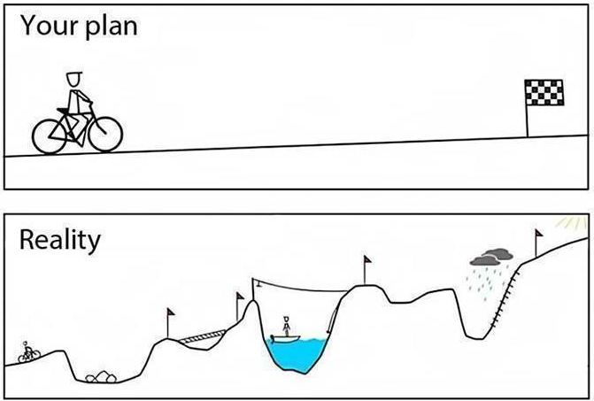

## TypeScript<br/>in the Field

## **Magic or Menace?**

Note:

- Title
- Thank you
- Seeing TS More Often. Ranting, Raving
- Believe the hype?
- SO: Top 10 Most Popular Technologies; Top 5 Most Loved

---

## Your Guide<br/>to **TypeScript**

- Technical Co-Founder @ **Zippy Software**
- Sr Application Developer @ **U.S. Engineering**
- Application Architect @ **The Lead Group**

Note:

- Leading teams using TypeScript across the Lead Generation, Industrial Construction and Educational industries
- Small teams
- Collaboration

---

## **Playground** vs <strong class="text-yellow">Production</strong>

Note:

- Seen people pulling their hair out
- Seen the lightbulb that goes off when TypeScript "clicks"

---

## What Is<br/> **TypeScript?**

---


---

## JavaScript<br/>**that scales.**

"TypeScript is a typed superset of JavaScript that compiles to plain JavaScript."

---

## JavaScript<br/>**that scales.**

"TypeScript is a <strong class="text-yellow"><u>typed</u></strong> superset of JavaScript that compiles to plain JavaScript."

---

## JavaScript<br/>**that scales.**

"TypeScript is a typed <strong class="text-yellow"><u>superset</u></strong> of JavaScript that compiles to plain JavaScript."

---

## JavaScript<br/>**that scales.**

"TypeScript is a typed superset of JavaScript that <strong class="text-yellow"><u>compiles</u></strong> to plain JavaScript."

---

## Why Use TypeScript?

Note:

- Million Dollar Question
- You as a developer or as a team
- How would you defend to your boss?

---


---

## JavaScript<br/>**that <u>scales</u>.**

---

## **Magic** or <br/> Menace?

Note:

- What are the magical elements of TypeScript?

---

## TypeScript<br/>**Does Not Exist**

Note:

- Compiled
- Explain TypeScript Playground

---

@snap[north span-100]

## Missing Person

@snapend

```ts
// TypeScript
type Hobby = "running" | "reading" | "gaming" | "painting" | "other";

interface Person {
  name: string;
  phone: string;
  hobby: Hobby;
}

const callPerson = (person: Person): void => console.log(person.phone);
```

---

@snap[north span-100]

## Missing Person

@snapend

```js
// JavaScript
"use strict";
const callPerson = person => console.log(person.phone);
```

Note:

- Pre-Compile vs Post-Compile
- TypeScript doesn't let you be irresponsible

---

## TypeScript <br/>**Watches Your Back**

Note:

- TS is always paying attention
- Knows your code better than you do
- Uses a built-in NodeJS debugger to monitor your code as you write it
- Easy to see with an example

---

#### EXAMPLE

## Increment<br/>**an Array**

---

@snap[north span-100]

## Increment an Array

@snapend

```js
// JS
const increment = num => num + 1;
const incrementAll = arr => arr.map(increment);

console.log(incrementAll([1, 2, 3, 4, 5])); // [2, 3, 4, 5, 6];
```

---

@snap[north span-100]

## Increment an Array

@snapend

```js
// JS
console.log(increment(undefined)); // NaN
console.log(incrementAll(["a", "b", "c"])); // ['a1', 'b1', 'c1'];
```

---

@snap[north span-100]

## Increment an Array

@snapend

```ts
// TS
const increment = (num: number): number => num + 1;
console.log(increment(3)); // 4
console.log(increment(undefined)); // Woops! You can't do that.

const incrementAll = (nums: Array<number>): Array<number> =>
  nums.map(increment);
console.log(incrementAll([1, 2, 3, 4, 5])); // [2, 3, 4, 5, 6]
console.log(incrementAll(["a", "b", "c"])); // Woops! You can't do that.
```

Note:

- Basic example, but compare to authenticated vs unauthenticated users

---

## Fail **Early**

Note:

- What is a REPL?
- TS REPL vs JS REPL
- Making mistakes is good

---

@snap[north span-100]

## Fail Early

@snapend

```ts
// TS
interface Person {
  name: string;
  phone: string;
}

const callPerson = (person: Person): void => console.log(person.phone);

// Elsewhere in our application...
callPerson("555-555-5555");
```

---

@snap[north span-100]

## Fail Early

@snapend


Note:

- Instant feedback shortens the loop
- Works on very complex types, which makes it more valuable than ESLint can be
- Like React PropTypes, but works from anywhere in your application, on any data types

---

## Type **Inference**

Note:

- How does TS keep track of everything? Type Inference
- Looking at the values that you pass into variables

---

@snap[north span-100]

## Type Inference

@snapend

```ts
// TS
const numArray = [1, 2, 3, 4, 5]; // number[]
const strArray = ["a", "b", "c"]; // string[]

let num = 6; // number
let str = "a"; // string

numArray.push(num); // OK!
strArray.push(str); // OK!

numArray.push(str); // Nope! Compiler Error
strArray.push(num); // Nope! Compiler Error
```

Note:

- Ensures that data and operations work correctly together.

---

@snap[north span-100]

## Keep Your **Tools**

@snapend

@snap[west]

### JS

- ESLint
- Libraries
- Frameworks
- Tests
- `npm watch`

@snapend

@snap[east text-left]

### TS

- TSLint
- Libraries
- Frameworks
- Tests
- `tsc watch`
  @snapend

---

## Magic or <br/> **Menace?**

Note:

- What are the trade-offs?
- It is not always pain free.

---

# **Debugging**

---

## **Pain-less** Errors


---

## **Painful** Errors


Note:

- 3rd party libraries, Deeply nested components, Complex types
- Develop skill in diagosing problems
- Remember that TS does not exist

---

## **Types !==** Values

---

@span[north]

## Types !== Values

@spanend

```ts
interface Person {
  name: string;
  phone: string;
}

const jonathan: Person = { name: "Jonathan", phone: "555-555-5555" };

console.log(typeof jonathan === Person); // false
console.log(jonathan instanceof Person); // Compiler Error

console.log("Huh?"); // Take a deep breath
```

---

@span[north]

## Types !== Values

@spanend

```ts
const isPerson = (val: Object): val is Person {
    return typeof val.name === 'string' && typeof val.phone === 'string';
}
```

Note:

- Type Guards are extraordinary, but not obvious.
- Perform type narrowing

---

## Implementation: <br/>**Plan** vs <span class="text-yellow">Reality</span>



Note:

- External libraries
- Refactoring

---

## Expect<br/>**Resistance**

Note:

- Polarizing
- JavaScript that Scales.

---

## <em>**Should**</em> you <br/>use TypeScript?

Note:

- Million Dollar Question
- You as a developer or as a team
- How would you defend to your boss?

---

# **You Decide.**

Note:

- What you're doing today works.
- There may be benefits, but there are tradeoffs too.
- Short talk, scratching the surface.

---

## **TypeScript**<br/> Changes The Way You Think

Note:

- Thinking in Types instead of thinking in Values
- Adopting new mental models, OOP vs FP, Dynamic vs Static Types
- Thinking categorically using generics

---

# **Questions?**

---?image=assets/img/code.jpg&opacity=60&position=left&size=45% 100%

@snap[east span-50 text-center]

### Thank You!

**@jwondrusch**

@snapend

@snap[south-east span-50 text-center]

#### P.S. We're Hiring

@snapend

Note:

- 1:15
- Thank You to This Dot, Vin Solutions, and most of all to everyone here.
- We're currently hiring
